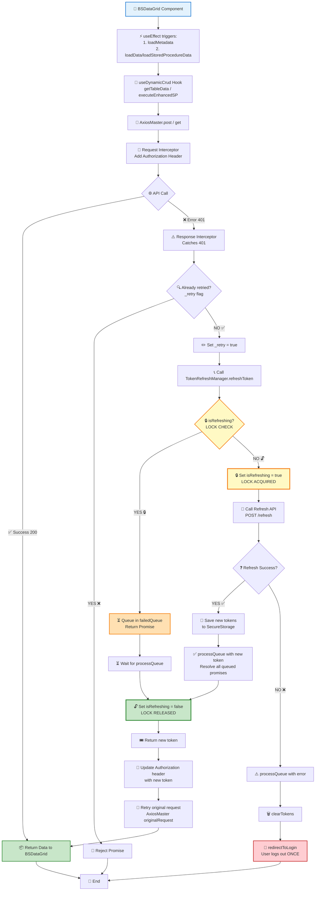
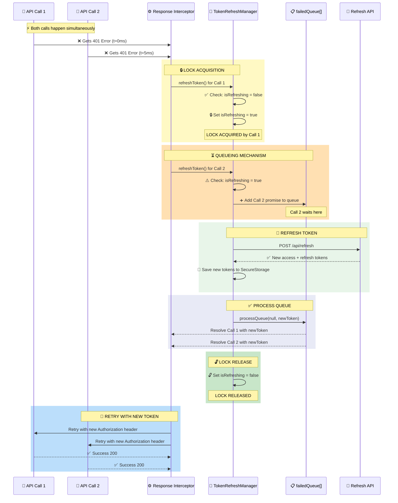

# BSDataGrid API Call Flow with Token Refresh

## 📊 Overview

ระบบนี้แก้ปัญหาการ call API หลายเส้นพร้อมกันใน BSDataGrid และการ refresh token ที่ทับซ้อนกัน

## 🎯 Problem Solved

### ปัญหาเดิม:

1. **BSDataGrid call API หลายเส้นพร้อมกัน** (metadata + data)
2. **เมื่อ token expired ทั้ง 2 เส้น fail 401 พร้อมกัน**
3. **Refresh token ถูกเรียกหลายครั้งซ้อนกัน**
4. **ผู้ใช้ถูกเด้งออกจากระบบ**

### Solution:

✅ **Token Refresh Lock Mechanism** - ป้องกัน refresh token ซ้ำซ้อน
✅ **Failed Request Queue** - เก็บ requests ที่ fail ไว้ retry ภายหลัง
✅ **Auto Retry** - retry requests ที่ fail หลัง refresh สำเร็จ
✅ **Single Logout** - redirect ไป login ครั้งเดียวเมื่อ refresh fail

## 🔄 Complete Flow Diagram

### 📍 Main Flow: BSDataGrid API Call with Token Refresh

### 🔐 Token Refresh Lock Mechanism Detail

## 🔒 Token Refresh Lock Mechanism

### Key Components:

1. **isRefreshing** (boolean)

   - Lock flag to prevent multiple simultaneous refreshes
   - Set to `true` when refresh starts
   - Set to `false` when refresh completes

2. **failedQueue** (array)

   - Stores { resolve, reject } promises
   - All 401 requests during refresh are queued here
   - Processed after refresh completes

3. **processQueue(error, token)**
   - Resolves or rejects all queued promises
   - Called after refresh success/failure

## 📝 Implementation Details

### 1. TokenRefreshManager.js

\`\`\`javascript
class TokenRefreshManager {
constructor() {
this.isRefreshing = false; // Lock flag
this.failedQueue = []; // Request queue
}

async refreshToken() {
// 🔒 Check if already refreshing
if (this.isRefreshing) {
// Queue this request
return new Promise((resolve, reject) => {
this.failedQueue.push({ resolve, reject });
});
}

    // 🔐 Acquire lock
    this.isRefreshing = true;

    try {
      // Refresh token API call
      const newToken = await callRefreshAPI();

      // ✅ Process all queued requests with success
      this.processQueue(null, newToken);

      return newToken;
    } catch (error) {
      // ❌ Process all queued requests with error
      this.processQueue(error, null);
      throw error;
    } finally {
      // 🔓 Release lock
      this.isRefreshing = false;
    }

}
}
\`\`\`

### 2. AxiosMaster.js Response Interceptor

\`\`\`javascript
AxiosMaster.interceptors.response.use(
response => response,
async (error) => {
const originalRequest = error.config;

    // Only handle 401 and only retry once
    if (error.response?.status === 401 && !originalRequest._retry) {
      originalRequest._retry = true;

      try {
        // Use TokenRefreshManager (with lock)
        const newToken = await TokenRefreshManager.refreshToken();

        // Update request with new token
        originalRequest.headers['Authorization'] = \`Bearer \${newToken}\`;

        // Retry original request
        return AxiosMaster(originalRequest);
      } catch (refreshError) {
        return Promise.reject(refreshError);
      }
    }

    return Promise.reject(error);

}
);
\`\`\`

## 🎬 Usage Scenarios

### Scenario 1: Single 401 Error

\`\`\`
Timeline:
0ms → API Call 1 starts
100ms → API Call 1 gets 401
101ms → TokenRefreshManager.refreshToken() called
102ms → isRefreshing = true (LOCK)
200ms → Refresh API returns new token
201ms → Save new tokens
202ms → processQueue() - no queued requests
203ms → isRefreshing = false (UNLOCK)
204ms → API Call 1 retries with new token
300ms → API Call 1 succeeds ✅
\`\`\`

### Scenario 2: Multiple 401 Errors (Your Case)

\`\`\`
Timeline:
0ms → API Call 1 (metadata) starts
5ms → API Call 2 (data) starts
100ms → API Call 1 gets 401
101ms → TokenRefreshManager.refreshToken() called for Call 1
102ms → isRefreshing = true (LOCK) 🔒
105ms → API Call 2 gets 401
106ms → TokenRefreshManager.refreshToken() called for Call 2
107ms → isRefreshing = true already! → Queue Call 2
200ms → Refresh API returns new token
201ms → Save new tokens
202ms → processQueue(null, newToken): - Call 1's promise resolves with newToken - Call 2's promise resolves with newToken
203ms → isRefreshing = false (UNLOCK) 🔓
204ms → API Call 1 retries with new token
205ms → API Call 2 retries with new token
300ms → Both calls succeed ✅✅
\`\`\`

### Scenario 3: Refresh Token Failed

\`\`\`
Timeline:
0ms → API Call 1 gets 401
1ms → API Call 2 gets 401
2ms → TokenRefreshManager.refreshToken() called for Call 1
3ms → isRefreshing = true (LOCK)
4ms → TokenRefreshManager.refreshToken() called for Call 2 → Queued
100ms → Refresh API fails (refresh token expired)
101ms → processQueue(error, null): - Call 1's promise rejects - Call 2's promise rejects
102ms → clearTokens() called once
103ms → redirectToLogin() called once
104ms → User redirected to login (ONCE) ✅
\`\`\`

## ✅ Benefits

1. **No Duplicate Refresh Requests**

   - Only one refresh happens at a time
   - Saves API calls and prevents rate limiting

2. **All Failed Requests Auto-Retry**

   - No need to manually refresh page
   - Seamless user experience

3. **Single Logout**

   - User redirected to login only once
   - No multiple alert dialogs

4. **Race Condition Safe**
   - Lock mechanism prevents concurrent refreshes
   - Queue ensures all requests are handled

## 🧪 Testing

### Test Case 1: Verify Lock Works

\`\`\`javascript
// In browser console
const status = TokenRefreshManager.getQueueStatus();
console.log(status);
// Expected: { isRefreshing: false, queueLength: 0 }
\`\`\`

### Test Case 2: Simulate Multiple 401s

1. Open Network tab in DevTools
2. Navigate to a page with BSDataGrid
3. Wait for token to expire (or manually delete token)
4. Refresh page
5. Observe:
   - Only 1 refresh API call
   - Multiple retries with new token
   - ✅ No multiple login redirects

### Test Case 3: Refresh Token Expired

1. Delete refresh_token from localStorage
2. Make an API call
3. Observe:
   - Single redirect to login
   - Clean error handling

## 📚 Files Modified

1. ✅ **TokenRefreshManager.js** (NEW)

   - Token refresh logic with lock
   - Failed request queue management

2. ✅ **AxiosMaster.js** (UPDATED)

   - Uses TokenRefreshManager
   - Implements retry logic
   - Removed duplicate refresh code

3. ✅ **useDynamicCrud.js** (NO CHANGES NEEDED)

   - Works automatically with updated AxiosMaster

4. ✅ **BSDataGrid.js** (NO CHANGES NEEDED)
   - Benefits from improved API handling

## 🎯 Summary

Before:

- ❌ Multiple token refreshes
- ❌ Race conditions
- ❌ Multiple login redirects
- ❌ Poor user experience

After:

- ✅ Single token refresh with lock
- ✅ Queue mechanism for failed requests
- ✅ Auto retry with new token
- ✅ Single login redirect
- ✅ Seamless user experience
