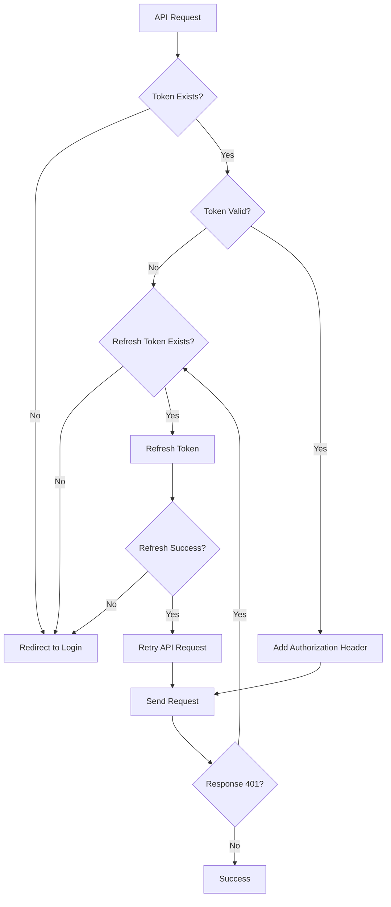

# 🔒 JWT Authentication Troubleshooting Guide

## 🚨 Error 401: Unauthorized

เมื่อเกิด error 401 ใน `useDynamicCrud` หรือ API calls อื่นๆ ใช้คู่มือนี้เพื่อแก้ปัญหา

## 🔍 การ Debug

### 1. ตรวจสอบ JWT Token ใน Browser Console

```javascript
// เปิด Browser DevTools (F12) และพิมพ์:
JWTDebugger.checkTokens();

// ผลลัพธ์จะแสดง:
// 📦 SecureStorage: token: ✅ EXISTS / ❌ NOT FOUND
// 💾 localStorage: token: ✅ EXISTS / ❌ NOT FOUND
// 🔄 sessionStorage: token: ✅ EXISTS / ❌ NOT FOUND
// ⏰ Token Info: expires, isExpired, user
```

### 2. ตรวจสอบ Network Requests

1. เปิด DevTools → Network tab
2. Filter เฉพาะ XHR requests
3. ดู request headers ว่ามี `Authorization: Bearer ...` หรือไม่
4. ดู response status และ error messages

### 3. ตรวจสอบ Console Logs

ระบบจะแสดง logs ดังนี้:

```
🔑 JWT Token check: Token exists / No token found
📡 API Request: GET /dynamic/metadata/table
❌ API Error: status: 401, message: "Unauthorized"
🔒 401 Unauthorized - Token may be expired or invalid
```

## 🛠️ วิธีแก้ปัญหา

### วิธีที่ 1: Login ใหม่

```javascript
// Clear all tokens และ login ใหม่
JWTDebugger.clearAllTokens();
// จากนั้นไป login page
```

### วิธีที่ 2: ตั้ง Token Manual (Development Only)

```javascript
// สำหรับการทดสอบเท่านั้น
JWTDebugger.setDummyToken();
```

### วิธีที่ 3: ตรวจสอบ Backend Gateway

1. ตรวจสอบว่า Gateway service ทำงานอยู่หรือไม่
2. ตรวจสอบว่า Authentication service ทำงานอยู่หรือไม่
3. ตรวจสอบ ocelot.json configuration

## 🔧 Common Issues & Solutions

### Issue 1: Token Not Found

```javascript
// Problem: No token in any storage
// ❌ API Error: No JWT token found in any storage

// Solution: Login ใหม่
window.location.href = "/login";
```

### Issue 2: Token Expired

```javascript
// Problem: Token หมดอายุ
// ⏰ Token Info: isExpired: ❌ EXPIRED

// Solution 1: Refresh token (automatic)
// ระบบจะทำ refresh อัตโนมัติ

// Solution 2: Manual refresh
JWTDebugger.clearAllTokens();
// Login ใหม่
```

### Issue 3: Invalid Token Format

```javascript
// Problem: Token รูปแบบไม่ถูกต้อง
// ❌ Invalid token format: error message

// Solution: Clear และ login ใหม่
JWTDebugger.clearAllTokens();
```

### Issue 4: Gateway Configuration

```javascript
// Problem: Gateway ไม่รับ Authorization header
// Check: ocelot.json AuthenticationOptions

{
  "AuthenticationOptions": {
    "AuthenticationProviderKey": "Bearer",
    "AllowedScopes": []
  }
}
```

## 📊 Token Management Flow



## 🧪 Testing Commands

### Development Testing

```javascript
// 1. Check current token status
JWTDebugger.checkTokens();

// 2. Test API call with current token
JWTDebugger.testAPICall();

// 3. Set dummy token for testing
JWTDebugger.setDummyToken();

// 4. Clear all tokens
JWTDebugger.clearAllTokens();
```

### Manual Token Setting (Development)

```javascript
// Set token manually in SecureStorage
import SecureStorage from "./utils/SecureStorage";
SecureStorage.set("token", "your-jwt-token-here");

// Or in localStorage
localStorage.setItem("token", "your-jwt-token-here");
```

## 🔒 Security Best Practices

### Token Storage Priority

1. **SecureStorage** (Encrypted) - Primary
2. **localStorage** - Fallback
3. **sessionStorage** - Temporary fallback

### Token Refresh Strategy

- Automatic refresh on 401 response
- Fallback to login if refresh fails
- Clear all tokens on security errors

### Development vs Production

```javascript
// Development: Debug logs enabled
if (process.env.NODE_ENV === "development") {
  console.log("🔑 Token debug info...");
}

// Production: Minimal logging
// Only error logs, no sensitive data
```

## 📞 Escalation Path

### Level 1: Frontend Issues

- Token storage problems
- Invalid token format
- Client-side refresh issues

### Level 2: Gateway Issues

- Authentication middleware problems
- Route configuration errors
- CORS issues

### Level 3: Backend Issues

- JWT validation problems
- Token expiration settings
- Database authentication

## 🔍 Debug Checklist

- [ ] Token exists in storage?
- [ ] Token format valid (3 parts separated by dots)?
- [ ] Token not expired?
- [ ] Authorization header added to request?
- [ ] Gateway authentication configured?
- [ ] Backend JWT validation working?
- [ ] CORS configured correctly?
- [ ] Network connectivity to Gateway?

---

## 🚀 Quick Fix Commands

```javascript
// Emergency reset (clears everything)
JWTDebugger.clearAllTokens();
window.location.reload();

// Debug current state
JWTDebugger.checkTokens();

// Test API connectivity
JWTDebugger.testAPICall();
```

**Updated**: ${new Date().toISOString().split('T')[0]}
**Status**: Ready for Debugging 🔧
