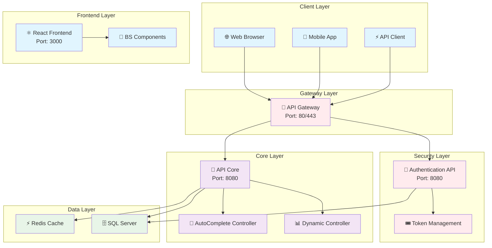
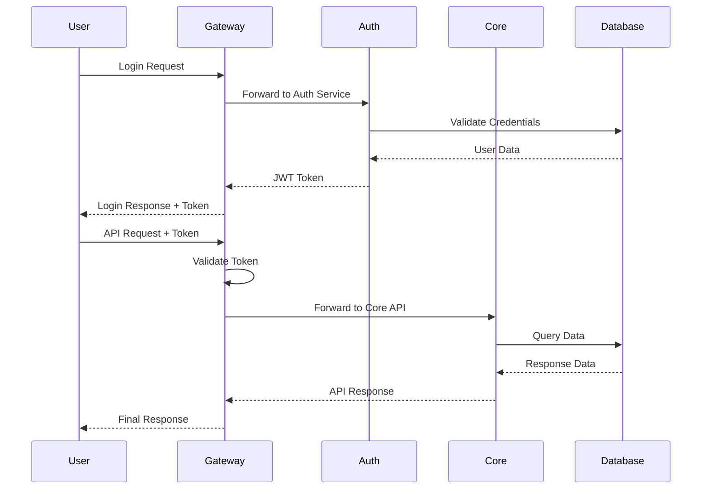
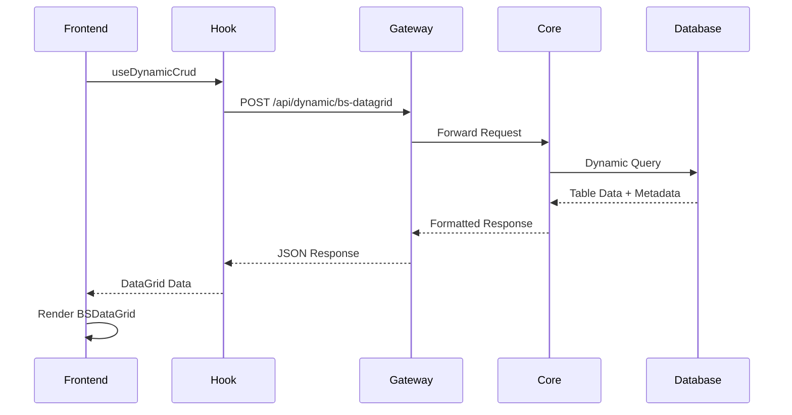
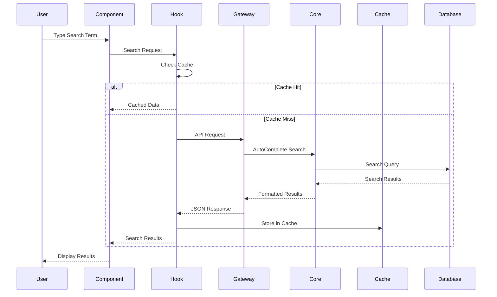

# 🏗️ โครงสร้างและสถาปัตยกรรม BS-Platform

## 📋 ภาพรวมระบบ

BS-Platform เป็นระบบ **Microservices** ที่ประกอบด้วย 3 ส่วนหลัก:

```
BS-Platform/
├── 🎯 BS-API-Core/          # Backend API หลัก (Core Business Logic)
├── 🔐 BS-API-Secure/        # Security & Gateway Layer
└── 🌐 BS-Web/               # Frontend React Applications
```

---

## 🏛️ สถาปัตยกรรมระบบ (System Architecture)



---

## 🎯 BS-API-Core (Backend หลัก)

### 📁 โครงสร้างไฟล์

```
BS-API-Core/ApiCore/
├── 🚀 Program.cs                    # Entry Point & Configuration
├── ⚙️ appsettings.json             # Configuration Settings
├── 🐳 Dockerfile                   # Container Configuration
├── 📝 .env                         # Environment Variables
│
├── 📂 Controllers/                 # API Controllers
│   ├── 📊 DynamicController.cs     # ✨ Dynamic CRUD Operations
│   ├── 🔽 AutoCompleteController.cs # ✨ AutoComplete Data
│   ├── 🗄️ DatabaseExampleController.cs # Database Examples
│   └── 📂 Base/                    # Base Controllers
│
├── 📂 Models/                      # Data Models
│   ├── 📂 Dynamic/                 # ✨ Dynamic Models
│   │   ├── DynamicDataGridRequest.cs
│   │   ├── DynamicBulkCreateRequest.cs
│   │   ├── DynamicBulkUpdateRequest.cs
│   │   ├── DynamicBulkDeleteRequest.cs
│   │   └── DynamicComboBoxRequest.cs
│   ├── 📂 Requests/                # Request Models
│   ├── 📂 Responses/               # Response Models
│   └── 📂 Base/                    # Base Models
│
├── 📂 Services/                    # Business Logic
│   ├── 📂 Implementation/          # Service Implementations
│   └── 📂 Interfaces/              # Service Interfaces
│
├── 📂 Data/                        # Data Access Layer
│   └── ApplicationDbContext.cs     # Entity Framework Context
│
├── 📂 SQL/                         # Database Scripts
├── 📂 Tests/                       # Unit Tests
├── 📂 docs/                        # API Documentation
└── 📂 Properties/                  # Project Properties
```

### 🚀 คุณสมบัติหลัก

#### 1. **DynamicController** (Dynamic CRUD Operations)

- 📊 **Dynamic DataGrid**: สร้าง DataGrid จาก metadata อัตโนมัติ
- 📦 **Bulk Operations**: การดำเนินการแบบหลายรายการ (Create, Update, Delete)
- 🔽 **ComboBox Integration**: ข้อมูล dropdown/select อัตโนมัติ
- 🎯 **BS Platform Properties**: รองรับ properties พิเศษของ BS Platform

```csharp
// API Endpoints
POST /api/dynamic/bs-datagrid     // BS Platform optimized endpoint
POST /api/dynamic/bulk-create     // Bulk insert
PUT  /api/dynamic/bulk-update     // Bulk update
DELETE /api/dynamic/bulk-delete   // Bulk delete
POST /api/dynamic/combobox        // ComboBox data
```

#### 2. **AutoCompleteController** (Smart Search)

- 🔍 **Smart Search**: ค้นหาข้อมูลอัตโนมัติ
- 🏷️ **Multi-Model Support**: รองรับหลายรูปแบบ (select, single, multi)
- ⚡ **Caching**: ระบบแคชเพื่อประสิทธิภาพ
- 🎯 **Filtering**: กรองข้อมูลตามเงื่อนไข

### 🛠️ Technology Stack

```yaml
Framework: ASP.NET Core 9.0
Database: SQL Server + Entity Framework Core
ORM: Dapper (High Performance)
Cache: Redis
Authentication: JWT Bearer Token
Documentation: Swagger/OpenAPI
Container: Docker + Docker Compose
```

---

## 🔐 BS-API-Secure (Security Layer)

### 📁 โครงสร้างไฟล์

```
BS-API-Secure/
├── 🚪 ApiGateway/                  # API Gateway (Ocelot)
│   ├── Program.cs
│   ├── ocelot.json                 # ✨ Routing Configuration
│   ├── Dockerfile
│   └── appsettings.json
│
├── 🔐 Authentication/              # Authentication Service
│   ├── Program.cs
│   ├── Controllers/
│   │   ├── AuthController.cs       # Login/Logout
│   │   ├── UsersController.cs      # User Management
│   │   └── ApplicationController.cs # App Management
│   ├── Services/
│   ├── Models/
│   ├── Dockerfile
│   └── appsettings.json
│
└── 🎟️ TokenManagement/             # JWT Token Management
    ├── Extensions/
    │   └── JwtAuthenticationExtensions.cs
    ├── Handler/
    │   └── JwtHelper.cs
    ├── Middleware/
    │   └── JwtBlacklistMiddleware.cs
    ├── Models/
    │   └── JwtSettings.cs
    └── Services/
        └── TokenValidatorService.cs
```

### 🛡️ คุณสมบัติ Security

#### 1. **API Gateway (Ocelot)**

- 🚪 **Single Entry Point**: จุดเข้าเดียวสำหรับ API ทั้งหมด
- 🔄 **Load Balancing**: กระจายโหลดอัตโนมัติ
- 🛡️ **Rate Limiting**: จำกัดการเรียก API
- 📊 **Request Routing**: เส้นทาง API ที่ยืดหยุ่น

```json
// ocelot.json - API Routing
{
  "Routes": [
    {
      "UpstreamPathTemplate": "/gateway/v1/api/login",
      "DownstreamPathTemplate": "/auth/login",
      "DownstreamHostAndPorts": [{ "Host": "auth_api", "Port": 8080 }]
    }
  ]
}
```

#### 2. **Authentication Service**

- 🔑 **JWT Authentication**: ระบบ token-based authentication
- 👥 **User Management**: จัดการผู้ใช้งาน
- 🏢 **Application Management**: จัดการแอปพลิเคชัน
- 🔒 **Password Reset**: รีเซ็ตรหัสผ่าน

#### 3. **Token Management**

- 🎟️ **JWT Token Generation**: สร้าง JWT tokens
- ⏰ **Token Expiration**: จัดการวันหมดอายุ
- 🚫 **Token Blacklisting**: ระบบ blacklist tokens
- 🔄 **Token Refresh**: ต่ออายุ tokens

---

## 🌐 BS-Web (Frontend Layer)

### 📁 โครงสร้างไฟล์

```
BS-Web/Frontend-Core/
├── 📦 package.json                 # Dependencies & Scripts
├── ⚛️ src/
│   ├── 🚀 index.js                 # Entry Point
│   ├── 📱 App.js                   # Main App Component
│   ├── 🛣️ AppRoutes.js             # Routing Configuration
│   │
│   ├── 📂 components/              # ✨ BS Components
│   │   ├── 📊 BSDataGrid.js        # ✨ Main DataGrid Component
│   │   ├── 🔽 BsAutoComplete.js    # ✨ AutoComplete Component
│   │   ├── 🚨 BSAlert.js           # ✨ Alert Component
│   │   ├── 📊 BSAlertSnackbar.js   # ✨ Snackbar Alert
│   │   ├── 🎭 BSAlertSwal2.js      # ✨ SweetAlert2 Integration
│   │   └── 📈 TopLinearProgress.js # ✨ Progress Indicator
│   │
│   ├── 📂 hooks/                   # Custom React Hooks
│   │   └── 🎣 useDynamicCrud.js    # ✨ CRUD Operations Hook
│   │
│   ├── 📂 examples/                # Usage Examples
│   │   ├── BSDataGridExamples.js
│   │   └── BSAutoCompleteExamples.js
│   │
│   ├── 📂 contexts/                # React Contexts
│   ├── 📂 layout/                  # Layout Components
│   ├── 📂 pages/                   # Page Components
│   ├── 📂 themes/                  # Theme Configuration
│   ├── 📂 utils/                   # Utility Functions
│   └── 📂 assets/                  # Static Assets
│
├── 📂 public/                      # Public Assets
└── 📂 docs/                        # Component Documentation
    ├── BSDataGrid.md
    ├── BsAutoComplete.md
    ├── BSAlert.md
    └── TopLinearProgress.md
```

### ⚛️ คุณสมบัติ Frontend

#### 1. **BSDataGrid Component**

- 📊 **MUI X DataGrid Pro**: เบสจาก Material-UI DataGrid Professional
- 🎛️ **Dynamic Generation**: สร้างตารางจาก metadata อัตโนมัติ
- 📦 **Bulk Operations**: การทำงานแบบหลายรายการ
- 🔽 **ComboBox Columns**: คอลัมน์ dropdown อัตโนมัติ
- 🌍 **Localization**: รองรับภาษาไทยและอังกฤษ
- 📱 **Responsive**: ปรับตัวกับขนาดหน้าจอ

```jsx
// การใช้งานพื้นฐาน
<BSDataGrid
  bsObj="t_wms_customer"
  bsPreObj="default"
  height={600}
/>

// การใช้งานขั้นสูง
<BSDataGrid
  bsObj="t_wms_customer"
  bsBulkEdit={true}
  bsBulkAdd={true}
  bsComboBox={[{
    Column: "status",
    Obj: "t_wms_status",
    Value: "id",
    Display: "name"
  }]}
/>
```

#### 2. **BsAutoComplete Component**

- 🔍 **Multiple Models**: select, single, multi selection
- ⚡ **Smart Caching**: ระบบแคชอัจฉริยะ
- 🎯 **Advanced Filtering**: กรองข้อมูลขั้นสูง
- 🔄 **Load on Demand**: โหลดข้อมูลตามต้องการ

```jsx
// Select Mode
<BsAutoComplete
  bsModel="select"
  bsObj="sec.t_com_combobox_item"
  bsFilters={[{ field: "group_name", op: "=", value: "platform" }]}
/>

// Multi Selection
<BsAutoComplete
  bsModel="multi"
  bsValue={["1", "3"]}
  bsOnChange={(val) => console.log("Selected:", val)}
/>
```

#### 3. **Alert Components**

- 🚨 **BSAlert**: Material-UI based alerts
- 📊 **BSAlertSnackbar**: Toast notifications
- 🎭 **BSAlertSwal2**: SweetAlert2 integration
- 📈 **TopLinearProgress**: Global progress indicator

### 🛠️ Technology Stack

```yaml
Framework: React 18+
UI Library: Material-UI (MUI) v5
State Management: React Context + Hooks
DataGrid: MUI X DataGrid Pro
HTTP Client: Axios
Build Tool: Create React App
Package Manager: npm
```

---

## 🔄 การทำงานร่วมกันของระบบ

### 1. **User Authentication Flow**



### 2. **Dynamic DataGrid Flow**



### 3. **AutoComplete Flow**



---

## 🐳 Docker Architecture

### 📦 Container Services

```yaml
# docker-compose.yml structure
services:
  # API Gateway
  api-gateway:
    image: bs-platform/api-gateway
    ports: ["80:8080", "443:8081"]

  # Authentication Service
  auth-service:
    image: bs-platform/auth-service
    ports: ["8080:8080"]

  # Core API Service
  core-api:
    image: bs-platform/core-api
    ports: ["8081:8080"]

  # Frontend Application
  frontend:
    image: bs-platform/frontend
    ports: ["3000:3000"]

  # Database Services
  sqlserver:
    image: mcr.microsoft.com/mssql/server:2022
    ports: ["1433:1433"]

  redis:
    image: redis:7-alpine
    ports: ["6379:6379"]
```

### 🔧 Environment Management

```bash
# Development
docker-compose -f docker-compose.yml -f docker-compose.dev.yml up

# Production
docker-compose -f docker-compose.yml -f docker-compose.prod.yml up

# Using PowerShell Script
.\docker-build.ps1 dev    # Development
.\docker-build.ps1 prod   # Production

# Using Makefile
make dev     # Development
make prod    # Production
```

---

## 📊 Database Schema

### 🗄️ Core Tables

```sql
-- Dynamic Metadata Tables
sec.t_com_combobox_item     -- ComboBox configurations
sec.t_com_table_metadata    -- Table metadata
sec.t_com_column_metadata   -- Column metadata

-- User Management
sec.t_users                 -- User accounts
sec.t_user_roles           -- User roles
sec.t_applications         -- Application registry

-- System Tables
sec.t_audit_logs          -- Audit logging
sec.t_system_config       -- System configuration
```

### 📈 Performance Optimization

- **Indexing Strategy**: Optimized indexes for dynamic queries
- **Connection Pooling**: Efficient database connections
- **Query Caching**: Redis-based query result caching
- **Lazy Loading**: On-demand data loading

---

## 🚀 Deployment & DevOps

### 🔄 CI/CD Pipeline

```yaml
# GitHub Actions Workflow
stages:
  - Code Quality Check
  - Unit Testing
  - Integration Testing
  - Docker Image Build
  - Security Scanning
  - Deployment
    - Development Environment
    - Staging Environment
    - Production Environment
```

### 📈 Monitoring & Logging

```yaml
Monitoring Tools:
  - Application Performance: Application Insights
  - Infrastructure: Docker Stats
  - Database: SQL Server Monitoring
  - Redis: Redis CLI Monitoring

Logging Strategy:
  - Application Logs: Structured JSON logging
  - Error Tracking: Centralized error logging
  - Audit Logs: User action tracking
  - Performance Logs: Response time monitoring
```

---

## 🎯 Key Benefits

### 🚀 **Performance**

- **Microservices Architecture**: Independent scaling
- **Caching Strategy**: Redis + Browser caching
- **Database Optimization**: Indexed queries + Connection pooling
- **CDN Integration**: Static asset delivery

### 🔒 **Security**

- **JWT Authentication**: Stateless authentication
- **API Gateway**: Centralized security
- **Rate Limiting**: DDoS protection
- **Token Blacklisting**: Enhanced security

### 🛠️ **Developer Experience**

- **Component-Based**: Reusable UI components
- **Type Safety**: TypeScript support
- **Hot Reload**: Fast development cycles
- **Comprehensive Documentation**: Easy onboarding

### 📱 **User Experience**

- **Responsive Design**: Mobile-first approach
- **Progressive Loading**: Smooth user interactions
- **Localization**: Multi-language support
- **Accessibility**: WCAG compliant

---

## 🔮 Future Roadmap

### Phase 1: Current (Q4 2025)

- ✅ Core API Development
- ✅ Security Layer Implementation
- ✅ Basic Frontend Components
- ✅ Docker Containerization

### Phase 2: Enhancement (Q1 2026)

- 🔄 Advanced DataGrid Features
- 🔄 Real-time Notifications
- 🔄 Advanced Analytics
- 🔄 Mobile App Support

### Phase 3: Enterprise (Q2 2026)

- 🔮 Multi-tenant Support
- 🔮 Advanced Security Features
- 🔮 AI/ML Integration
- 🔮 Kubernetes Orchestration

---

## 📞 Support & Documentation

### 📚 **Documentation Links**

- [API Documentation](./BS-API-Core/docs/)
- [Component Guide](./BS-Web/Frontend-Core/docs/)
- [Docker Guide](./BS-API-Core/ApiCore/DOCKER.md)
- [Integration Examples](./docs/)

### 👥 **Team Contacts**

- **Backend Development**: Core API Team
- **Frontend Development**: UI/UX Team
- **DevOps & Infrastructure**: Platform Team
- **Security**: Security Team

---

**BS-Platform Team** | **Version 1.0** | **Updated: September 2025**
