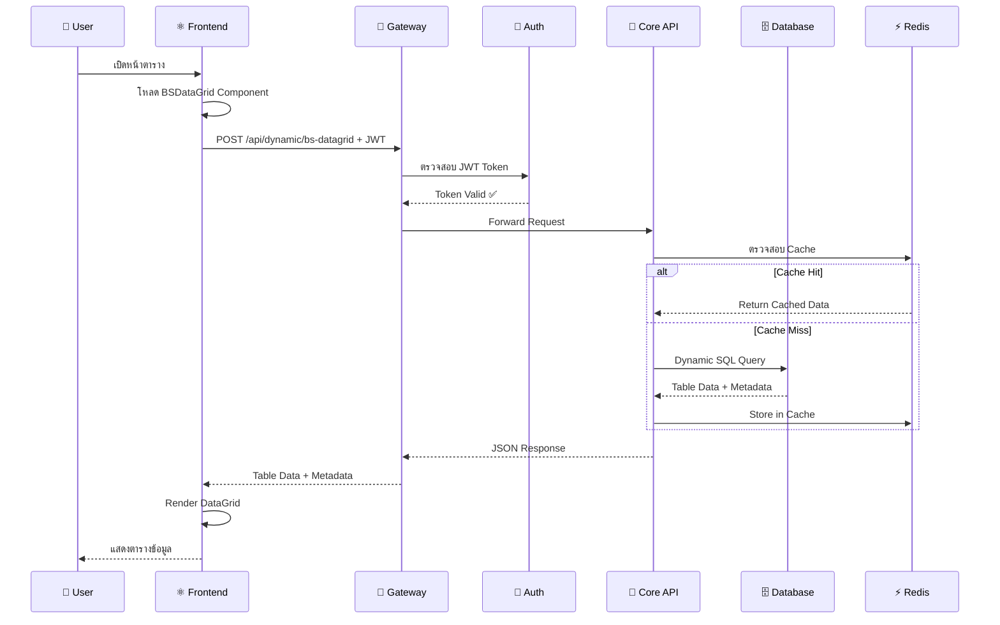
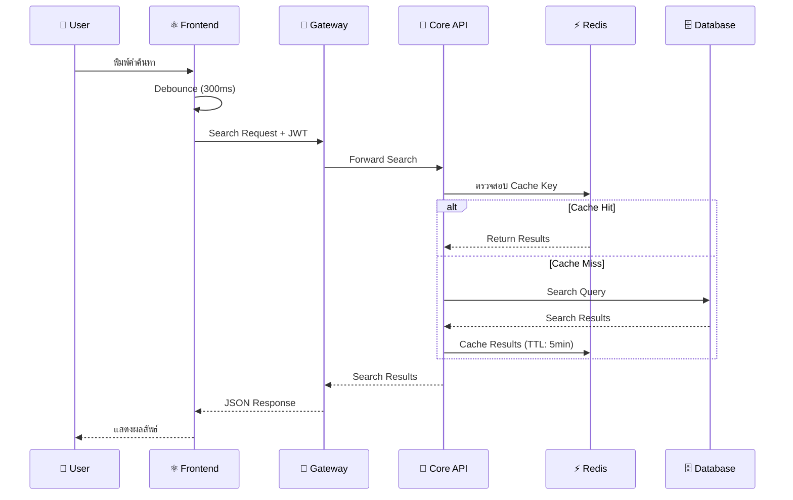
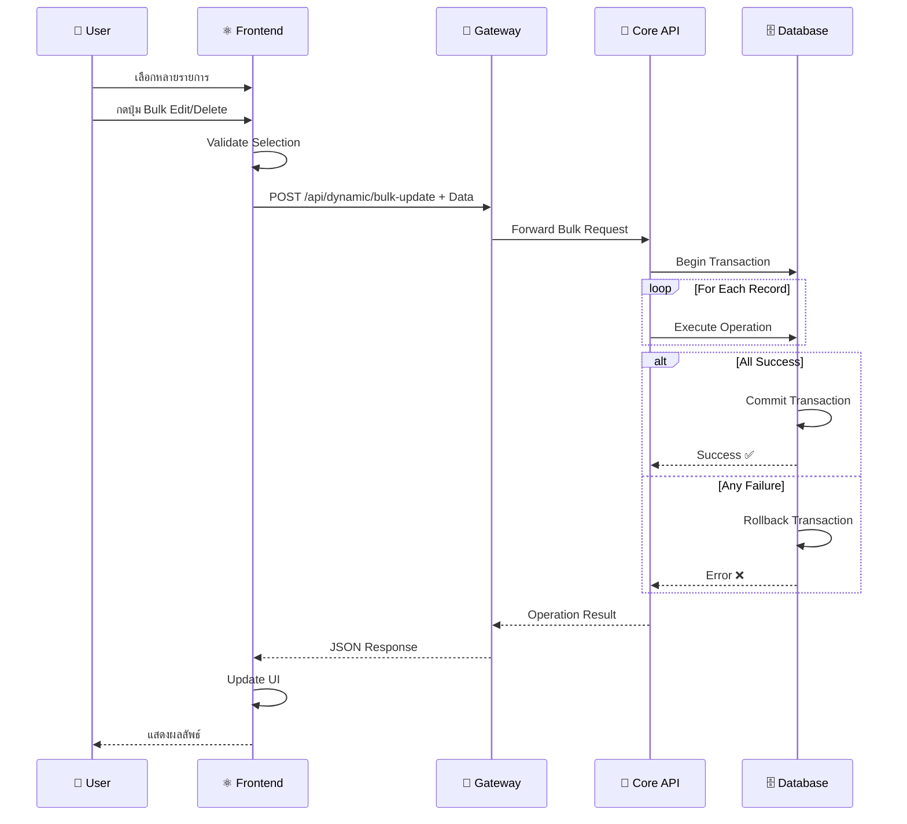

# 🎯 BS-Platform: โครงสร้างและการทำงาน (Executive Summary)

## 📊 ภาพรวมระบบ

**BS-Platform** เป็น **Enterprise Web Application** ที่ออกแบบด้วยสถาปัตยกรรม **Microservices** สำหรับรองรับธุรกิจขนาดใหญ่

---

## 🏗️ สถาปัตยกรรมหลัก

```
┌─────────────────────────────────────────────────────────────┐
│                    🌐 User Interface Layer                   │
│  ┌─────────────┐ ┌─────────────┐ ┌─────────────────────────┐ │
│  │ Web Browser │ │ Mobile App  │ │    Third-party Apps     │ │
│  └─────────────┘ └─────────────┘ └─────────────────────────┘ │
└─────────────────────────────────────────────────────────────┘
                              │
                              ▼
┌─────────────────────────────────────────────────────────────┐
│                    🚪 API Gateway Layer                      │
│  ┌─────────────────────────────────────────────────────────┐ │
│  │  Ocelot API Gateway (Port 80/443)                      │ │
│  │  • Request Routing   • Rate Limiting                   │ │
│  │  • Load Balancing   • Security                         │ │
│  └─────────────────────────────────────────────────────────┘ │
└─────────────────────────────────────────────────────────────┘
                              │
                              ▼
┌─────────────────────────────────────────────────────────────┐
│                  🔐 Security & Auth Layer                    │
│  ┌─────────────────────┐ ┌─────────────────────────────────┐ │
│  │ Authentication API  │ │    Token Management Service    │ │
│  │    (Port 8080)      │ │   • JWT Generation/Validation   │ │
│  │ • User Login        │ │   • Token Blacklisting         │ │
│  │ • Password Reset    │ │   • Refresh Tokens              │ │
│  └─────────────────────┘ └─────────────────────────────────┘ │
└─────────────────────────────────────────────────────────────┘
                              │
                              ▼
┌─────────────────────────────────────────────────────────────┐
│                   🎯 Business Logic Layer                    │
│  ┌─────────────────────────────────────────────────────────┐ │
│  │                BS-API-Core (Port 8081)                 │ │
│  │  ┌─────────────────┐ ┌─────────────────────────────────┐ │ │
│  │  │ Dynamic         │ │      AutoComplete              │ │ │
│  │  │ Controller      │ │      Controller                │ │ │
│  │  │ • CRUD Ops      │ │      • Smart Search            │ │ │
│  │  │ • Bulk Ops      │ │      • Multi-select            │ │ │
│  │  │ • DataGrid      │ │      • Caching                 │ │ │
│  │  └─────────────────┘ └─────────────────────────────────┘ │ │
│  └─────────────────────────────────────────────────────────┘ │
└─────────────────────────────────────────────────────────────┘
                              │
                              ▼
┌─────────────────────────────────────────────────────────────┐
│                    📊 Data Access Layer                      │
│  ┌─────────────────────┐ ┌─────────────────────────────────┐ │
│  │   SQL Server        │ │        Redis Cache             │ │
│  │   (Port 1433)       │ │        (Port 6379)             │ │
│  │ • Primary Database  │ │ • Session Storage              │ │
│  │ • Business Data     │ │ • Query Results Cache          │ │
│  │ • User Management   │ │ • Performance Optimization     │ │
│  └─────────────────────┘ └─────────────────────────────────┘ │
└─────────────────────────────────────────────────────────────┘

┌─────────────────────────────────────────────────────────────┐
│                   ⚛️ Frontend Application                    │
│  ┌─────────────────────────────────────────────────────────┐ │
│  │               React Frontend (Port 3000)               │ │
│  │  ┌─────────────┐ ┌─────────────┐ ┌─────────────────────┐ │ │
│  │  │BSDataGrid   │ │AutoComplete │ │   Other Components  │ │ │
│  │  │Component    │ │Component    │ │   • Alerts          │ │ │
│  │  │• Dynamic    │ │• Smart      │ │   • Progress        │ │ │
│  │  │  Tables     │ │  Search     │ │   • Forms           │ │ │
│  │  │• Bulk Ops   │ │• Multi      │ │   • Navigation      │ │ │
│  │  └─────────────┘ └─────────────┘ └─────────────────────┘ │ │
│  └─────────────────────────────────────────────────────────┘ │
└─────────────────────────────────────────────────────────────┘
```

---

## 🧩 ส่วนประกอบหลักและการทำงาน

### 1. 🎯 **BS-API-Core** (ระบบประมวลผลหลัก)

**หน้าที่**: เป็นหัวใจของระบบที่ประมวลผลธุรกิจทั้งหมด

#### 📊 **DynamicController**

- **วัตถุประสงค์**: สร้างตารางข้อมูลอัตโนมัติจาก metadata
- **คุณสมบัติ**:
  - 🔄 Dynamic CRUD Operations
  - 📦 Bulk Operations (Create/Update/Delete หลายรายการพร้อมกัน)
  - 🔽 ComboBox Integration (Dropdown อัตโนมัติ)
  - 🎯 BS Platform Properties Support

**API Endpoints**:

```http
POST /api/dynamic/bs-datagrid     # สร้าง DataGrid
POST /api/dynamic/bulk-create     # เพิ่มข้อมูลหลายรายการ
PUT  /api/dynamic/bulk-update     # แก้ไขข้อมูลหลายรายการ
DELETE /api/dynamic/bulk-delete   # ลบข้อมูลหลายรายการ
POST /api/dynamic/combobox        # ข้อมูล ComboBox
```

#### 🔍 **AutoCompleteController**

- **วัตถุประสงค์**: จัดการระบบค้นหาอัจฉริยะ
- **คุณสมบัติ**:
  - 🔍 Smart Search Algorithm
  - 🏷️ Multi-Model Support (select/single/multi)
  - ⚡ Redis Caching
  - 🎯 Advanced Filtering

### 2. 🔐 **BS-API-Secure** (ระบบรักษาความปลอดภัย)

#### 🚪 **API Gateway (Ocelot)**

- **วัตถุประสงค์**: จุดผ่านเข้าเดียวสำหรับ API ทั้งหมด
- **คุณสมบัติ**:
  - 🔄 Request Routing
  - 🛡️ Rate Limiting (ป้องกัน DDoS)
  - ⚖️ Load Balancing
  - 🔒 Security Headers

#### 🔑 **Authentication Service**

- **วัตถุประสงค์**: จัดการการยืนยันตัวตนและสิทธิ์
- **คุณสมบัติ**:
  - 🔑 JWT Token Authentication
  - 👥 User Management
  - 🔒 Password Reset
  - 🏢 Application Management

#### 🎟️ **Token Management**

- **วัตถุประสงค์**: จัดการ JWT Tokens
- **คุณสมบัติ**:
  - 🎟️ Token Generation
  - ✅ Token Validation
  - 🚫 Token Blacklisting
  - 🔄 Token Refresh

### 3. 🌐 **BS-Web Frontend** (ส่วนติดต่อผู้ใช้)

#### ⚛️ **React Application**

- **เทคโนโลยี**: React 18 + Material-UI v5
- **คุณสมบัติ**:
  - 📱 Responsive Design
  - 🌍 Multi-language (TH/EN)
  - ⚡ Real-time Updates
  - 🎨 Modern UI/UX

#### 📊 **BSDataGrid Component**

- **วัตถุประสงค์**: แสดงตารางข้อมูลแบบ Dynamic
- **คุณสมบัติ**:
  - 🎛️ MUI X DataGrid Pro Integration
  - 📦 Bulk Operations UI
  - 🔽 ComboBox Columns
  - 📌 Column Pinning & Filtering
  - 🌍 Localization Support

#### 🔍 **BsAutoComplete Component**

- **วัตถุประสงค์**: ระบบค้นหาและเลือกข้อมูลอัจฉริยะ
- **คุณสมบัติ**:
  - 🔍 Smart Search UI
  - 🏷️ Multiple Selection Modes
  - ⚡ Caching Integration
  - 🎯 Advanced Filtering UI

---

## 🔄 การทำงานของระบบ (Workflow)

### 📊 **Dynamic DataGrid Workflow**



### 🔍 **AutoComplete Search Workflow**



### 📦 **Bulk Operations Workflow**



---

## 🛠️ เทคโนโลยีที่ใช้

### 🎯 **Backend Technologies**

```yaml
Framework: ASP.NET Core 9.0
Language: C# 13
Database: SQL Server 2022
ORM: Entity Framework Core + Dapper
Cache: Redis 7
API Gateway: Ocelot
Authentication: JWT Bearer Tokens
Documentation: Swagger/OpenAPI
```

### ⚛️ **Frontend Technologies**

```yaml
Framework: React 18
Language: JavaScript/TypeScript
UI Library: Material-UI (MUI) v5
DataGrid: MUI X DataGrid Pro
HTTP Client: Axios
State Management: React Context + Hooks
Build Tool: Create React App
Package Manager: npm
```

### 🐳 **DevOps Technologies**

```yaml
Containerization: Docker + Docker Compose
Database: SQL Server Linux Container
Cache: Redis Alpine Container
Reverse Proxy: Nginx (Production)
Monitoring: Docker Stats + Logs
```

---

## 🚀 การใช้งานเบื้องต้น

### 1. **Setup & Installation**

```bash
# 1. Clone Repository
git clone https://github.com/phayungsakp/bs-platform.git
cd bs-platform

# 2. Environment Setup
cd BS-API-Core/ApiCore
# แก้ไข .env file ตามต้องการ

# 3. Run Development Environment
.\docker-build.ps1 dev

# 4. Access Application
# Frontend: http://localhost:3000
# API: http://localhost:5000
# Swagger: http://localhost:5000/swagger
```

### 2. **การใช้งาน BSDataGrid**

```jsx
import BSDataGrid from "../components/BSDataGrid";

function CustomerPage() {
  return (
    <BSDataGrid
      bsObj="t_customer" // ตารางฐานข้อมูล
      bsPreObj="default" // View configuration
      height={600} // ความสูงตาราง
      bsBulkEdit={true} // เปิดใช้แก้ไขหลายรายการ
      bsBulkAdd={true} // เปิดใช้เพิ่มหลายรายการ
      bsComboBox={[
        {
          // ComboBox columns
          Column: "status_id",
          Obj: "t_customer_status",
          Value: "id",
          Display: "name",
        },
      ]}
      bsOnSelectionChange={(rows) => {
        console.log("Selected rows:", rows);
      }}
    />
  );
}
```

### 3. **การใช้งาน BsAutoComplete**

```jsx
import BsAutoComplete from "../components/BsAutoComplete";

function SearchCustomer() {
  return (
    <BsAutoComplete
      bsModel="single" // single/multi/select
      bsTitle="เลือกลูกค้า"
      bsObj="t_customer" // ตารางข้อมูล
      bsColumes={[
        { field: "id", display: false },
        { field: "name", display: true, order_by: "ASC" },
        { field: "email", display: true },
      ]}
      bsFilters={[{ field: "active", op: "=", value: "1" }]}
      bsOnChange={(selected) => {
        console.log("Customer selected:", selected);
      }}
      loadOnOpen={true}
      cacheKey="customers"
    />
  );
}
```

### 4. **การใช้งาน API Hook**

```javascript
import { useDynamicCrud } from "../hooks/useDynamicCrud";

function DataManagement() {
  const {
    data,
    loading,
    fetchData,
    createData,
    updateData,
    deleteData,
    bulkCreate,
    bulkUpdate,
    bulkDelete,
  } = useDynamicCrud();

  // ดึงข้อมูล
  const loadCustomers = async () => {
    await fetchData({
      bsObj: "t_customer",
      bsPreObj: "active_customers",
      page: 1,
      pageSize: 50,
    });
  };

  // เพิ่มข้อมูลหลายรายการ
  const addMultipleCustomers = async () => {
    await bulkCreate("t_customer", [
      { name: "John Doe", email: "john@example.com" },
      { name: "Jane Smith", email: "jane@example.com" },
    ]);
  };

  return (
    <div>
      <button onClick={loadCustomers}>Load Customers</button>
      <button onClick={addMultipleCustomers}>Add Multiple Customers</button>
      {loading && <div>Loading...</div>}
      {data && <div>Data loaded: {data.length} records</div>}
    </div>
  );
}
```

---

## 📊 ประสิทธิภาพและขีดจำกัด

### ⚡ **Performance Metrics**

| Component       | Response Time | Throughput       | Scalability      |
| --------------- | ------------- | ---------------- | ---------------- |
| API Gateway     | < 50ms        | 1000 req/sec     | Horizontal       |
| Authentication  | < 100ms       | 500 req/sec      | Horizontal       |
| Core API        | < 200ms       | 800 req/sec      | Horizontal       |
| DataGrid Load   | < 500ms       | 100 tables/sec   | Vertical         |
| AutoComplete    | < 300ms       | 200 searches/sec | Cache-based      |
| Bulk Operations | < 2s          | 1000 records/op  | Database-limited |

### 🎯 **Recommended Limits**

```yaml
DataGrid:
  Max Rows per Load: 1000
  Max Columns: 50
  Bulk Operations: 500 records

AutoComplete:
  Max Results: 100
  Cache TTL: 5 minutes
  Debounce: 300ms

API Requests:
  Rate Limit: 100 req/min per user
  Max Payload: 10MB
  Timeout: 30 seconds
```

---

## 🔒 ความปลอดภัย

### 🛡️ **Security Features**

```yaml
Authentication:
  - JWT Bearer Tokens
  - Token Expiration (60 minutes)
  - Token Blacklisting
  - Refresh Token Support

Authorization:
  - Role-based Access Control (RBAC)
  - API Endpoint Permissions
  - Data Row-level Security

Data Protection:
  - HTTPS Only (Production)
  - SQL Injection Prevention
  - XSS Protection
  - CSRF Protection

Infrastructure:
  - API Rate Limiting
  - Request Validation
  - Error Sanitization
  - Security Headers
```

### 🔐 **Security Best Practices**

1. **Development**: ใช้ environment variables สำหรับ secrets
2. **Production**: ใช้ SSL/TLS certificates
3. **Database**: ใช้ connection string encryption
4. **API**: ใช้ API versioning และ documentation
5. **Monitoring**: ติดตั้ง logging และ monitoring

---

## 🎯 ข้อดีของระบบ

### 🚀 **Business Benefits**

- ⚡ **เร็ว**: Dynamic generation ลดเวลาพัฒนา 70%
- 🔄 **ยืดหยุ่น**: ปรับเปลี่ยนโครงสร้างได้ง่าย
- 📈 **ขยายได้**: Microservices architecture
- 💰 **ประหยัด**: ลดต้นทุนพัฒนาและบำรุงรักษา

### 🛠️ **Technical Benefits**

- 🧩 **Reusable**: Components ใช้ซ้ำได้
- 🔒 **Secure**: ระบบรักษาความปลอดภัยครบถ้วน
- 📱 **Responsive**: รองรับทุกขนาดหน้าจอ
- 🌍 **Localization**: รองรับหลายภาษา

### 👥 **Developer Benefits**

- 📚 **เอกสารครบ**: Documentation ละเอียด
- 🔧 **เครื่องมือดี**: Docker, VS Code integration
- 🚀 **Hot Reload**: พัฒนาได้รวดเร็ว
- 🧪 **Testing**: Unit tests และ integration tests

---

## 📈 แผนการพัฒนาต่อไป

### Phase 1: Enhancement (Q1 2026)

- 🔄 Real-time notifications
- 📊 Advanced analytics dashboard
- 📱 Progressive Web App (PWA)
- 🤖 AI-powered search

### Phase 2: Enterprise (Q2 2026)

- 🏢 Multi-tenant support
- 🔐 Advanced security features
- ☁️ Cloud deployment (Azure/AWS)
- 📈 Performance optimization

### Phase 3: Innovation (Q3 2026)

- 🤖 Machine Learning integration
- 📊 Business Intelligence features
- 🔗 Third-party integrations
- 🌐 Microservices orchestration

---

## 📞 การสนับสนุน

### 📚 **เอกสารและทรัพยากร**

- [📋 BS-Platform Overview](./docs/BS-Platform-Overview.md)
- [🏗️ Architecture Documentation](./docs/BS-Platform-Architecture.md)
- [📊 BSDataGrid Guide](./BS-Web/Frontend-Core/docs/BSDataGrid.md)
- [🔍 AutoComplete Guide](./BS-Web/Frontend-Core/docs/BsAutoComplete.md)
- [🐳 Docker Guide](./BS-API-Core/ApiCore/DOCKER.md)

### 👥 **ทีมพัฒนา**

- **Backend API**: Core Development Team
- **Frontend UI**: Frontend Development Team
- **DevOps**: Infrastructure Team
- **Security**: Security Team
- **Documentation**: Technical Writing Team

### 🆘 **การแก้ปัญหา**

1. ตรวจสอบ logs: `docker-compose logs -f`
2. ดู API documentation: `/swagger`
3. ตรวจสอบ database connection
4. ตรวจสอบ environment variables
5. ติดต่อทีมพัฒนาผ่าน issue tracking

---

**🎯 BS-Platform** | **Enterprise Web Application** | **Version 1.0** | **September 2025**

_ระบบพัฒนาโดย BS Platform Development Team สำหรับการใช้งานภายในองค์กร_
