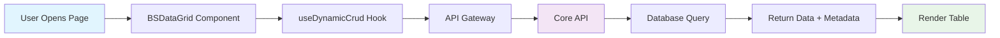
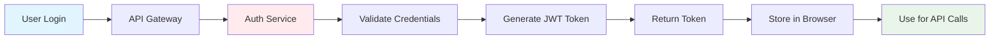

# 📋 BS-Platform โครงสร้างระบบ (สรุป)

## 🎯 ภาพรวม

BS-Platform คือระบบ **Enterprise Web Application** ที่ใช้สถาปัตยกรรม **Microservices** ประกอบด้วย:

```
🏗️ BS-Platform Architecture
├── 🌐 Frontend (React)     → Port 3000
├── 🚪 API Gateway          → Port 80/443
├── 🔐 Authentication       → Port 8080
├── 🎯 Core API            → Port 8081
├── 🗄️ SQL Server          → Port 1433
└── ⚡ Redis Cache          → Port 6379
```

---

## 🧩 ส่วนประกอบหลัก

### 1. 🎯 **BS-API-Core** (Backend หลัก)

**หน้าที่**: ประมวลผลธุรกิจหลัก, CRUD Operations, Dynamic DataGrid

```csharp
// Controllers หลัก
📊 DynamicController     // Dynamic table operations
🔽 AutoCompleteController // Smart search & dropdown
🗄️ DatabaseExampleController // Database examples

// คุณสมบัติพิเศษ
✨ Dynamic DataGrid Generation
✨ Bulk Operations (Create/Update/Delete)
✨ ComboBox Integration
✨ BS Platform Properties Support
```

**เทคโนโลยี**: `.NET 9`, `Entity Framework`, `Dapper`, `SQL Server`, `Redis`

### 2. 🔐 **BS-API-Secure** (Security Layer)

**หน้าที่**: จัดการความปลอดภัย, Authentication, API Gateway

```yaml
🚪 API Gateway (Ocelot):
  - Single entry point
  - Request routing
  - Rate limiting
  - Load balancing

🔐 Authentication Service:
  - JWT token management
  - User authentication
  - Password reset
  - User management

🎟️ Token Management:
  - Token generation
  - Token validation
  - Token blacklisting
  - Token refresh
```

### 3. 🌐 **BS-Web** (Frontend)

**หน้าที่**: User Interface, การแสดงผล, User Experience

```jsx
// Components หลัก
📊 BSDataGrid          // Dynamic table with MUI X DataGrid Pro
🔽 BsAutoComplete      // Smart search dropdown
🚨 BSAlert             // Alert notifications
📈 TopLinearProgress   // Loading indicators

// Hooks
🎣 useDynamicCrud      // API communication hook

// Features
✨ Responsive Design
✨ Multi-language (TH/EN)
✨ Real-time Updates
✨ Bulk Operations UI
```

**เทคโนโลยี**: `React 18`, `Material-UI v5`, `MUI X DataGrid Pro`, `Axios`

---

## 🔄 การทำงานของระบบ

### 📊 **Dynamic DataGrid Workflow**



### 🔐 **Authentication Workflow**



---

## 🚀 การใช้งานพื้นฐาน

### 1. **BSDataGrid** (ตารางข้อมูลอัตโนมัติ)

```jsx
import BSDataGrid from "../components/BSDataGrid";

// การใช้งานพื้นฐาน
<BSDataGrid
  bsObj="t_customer"     // ชื่อตาราง
  height={600}           // ความสูง
/>

// การใช้งานขั้นสูง
<BSDataGrid
  bsObj="t_customer"
  bsPreObj="customer_view"
  bsCols="id,name,email,phone"
  bsBulkEdit={true}      // แก้ไขหลายรายการ
  bsBulkAdd={true}       // เพิ่มหลายรายการ
  bsComboBox={[{         // Dropdown columns
    Column: "status_id",
    Obj: "t_status",
    Value: "id",
    Display: "name"
  }]}
/>
```

### 2. **BsAutoComplete** (ช่องค้นหาอัจฉริยะ)

```jsx
import BsAutoComplete from "../components/BsAutoComplete";

// Dropdown แบบเลือกเดียว
<BsAutoComplete
  bsModel="select"
  bsTitle="เลือกลูกค้า"
  bsObj="t_customer"
  bsColumes={[
    { field: "id", display: false },
    { field: "name", display: true, order_by: "ASC" }
  ]}
  bsOnChange={(value) => console.log("Selected:", value)}
/>

// แบบเลือกหลายรายการ
<BsAutoComplete
  bsModel="multi"
  bsValue={["1", "2", "3"]}
  bsOnChange={(values) => console.log("Selected multiple:", values)}
/>
```

### 3. **API Calls** (เรียกใช้ API)

```javascript
import { useDynamicCrud } from "../hooks/useDynamicCrud";

function MyComponent() {
  const { data, loading, fetchData, createData, updateData, deleteData } =
    useDynamicCrud();

  // ดึงข้อมูล
  const loadData = () => {
    fetchData({
      bsObj: "t_customer",
      bsPreObj: "default",
      page: 1,
      pageSize: 25,
    });
  };

  // เพิ่มข้อมูล
  const addData = () => {
    createData("t_customer", {
      name: "John Doe",
      email: "john@example.com",
    });
  };

  return (
    <div>
      {loading && <div>Loading...</div>}
      <button onClick={loadData}>Load Data</button>
      <button onClick={addData}>Add Data</button>
    </div>
  );
}
```

---

## 🐳 การรันระบบด้วย Docker

### 🛠️ **Setup & Run**

```bash
# 1. Clone repository
git clone https://github.com/phayungsakp/bs-platform.git
cd bs-platform

# 2. Development Environment
cd BS-API-Core/ApiCore
.\docker-build.ps1 dev

# 3. Production Environment
.\docker-build.ps1 prod

# 4. Check services
docker-compose ps
```

### 📊 **Service Ports**

| Service     | Development           | Production            | Description    |
| ----------- | --------------------- | --------------------- | -------------- |
| Frontend    | http://localhost:3000 | http://localhost      | React Web App  |
| API Gateway | http://localhost:80   | http://localhost:80   | Ocelot Gateway |
| Core API    | http://localhost:5000 | http://localhost:8081 | Main API       |
| Auth API    | http://localhost:5001 | http://localhost:8080 | Security API   |
| Database    | localhost:1433        | localhost:1433        | SQL Server     |
| Redis       | localhost:6379        | localhost:6379        | Cache          |

### 🔧 **Useful Commands**

```bash
# View logs
docker-compose logs -f

# Restart services
docker-compose restart

# Stop all services
docker-compose down

# Clean up
docker-compose down -v
docker system prune -f
```

---

## 📁 โครงสร้างไฟล์สำคัญ

```
BS-Platform/
├── 📊 BS-API-Core/ApiCore/
│   ├── Controllers/DynamicController.cs      # ✨ Dynamic CRUD
│   ├── Controllers/AutoCompleteController.cs # ✨ AutoComplete
│   ├── Models/Dynamic/                       # ✨ Request/Response models
│   ├── docker-compose.yml                    # 🐳 Container config
│   └── Dockerfile                            # 🐳 Image config
│
├── 🔐 BS-API-Secure/
│   ├── ApiGateway/ocelot.json               # 🚪 API routes
│   ├── Authentication/Controllers/          # 🔑 Auth endpoints
│   └── TokenManagement/                     # 🎟️ JWT management
│
├── 🌐 BS-Web/Frontend-Core/src/
│   ├── components/BSDataGrid.js             # ✨ Main DataGrid
│   ├── components/BsAutoComplete.js         # ✨ AutoComplete
│   ├── hooks/useDynamicCrud.js             # ✨ API hook
│   └── examples/                           # 📝 Usage examples
│
└── 📚 docs/
    ├── BS-Platform-Architecture.md          # 🏗️ Full architecture
    ├── BSDataGrid-Integration.md            # 🔗 Integration guide
    └── README.md                           # 📋 Quick start
```

---

## 🎯 คุณสมบัติเด่น

### ⚡ **Performance**

- Microservices architecture สำหรับ scalability
- Redis caching สำหรับ performance
- Connection pooling สำหรับ database efficiency
- Lazy loading สำหรับ UI responsiveness

### 🔒 **Security**

- JWT token-based authentication
- API Gateway เป็น single entry point
- Rate limiting ป้องกัน DDoS
- Token blacklisting สำหรับ security

### 🛠️ **Developer Experience**

- Component-based architecture
- TypeScript support
- Hot reload development
- Comprehensive documentation
- Docker containerization

### 📱 **User Experience**

- Responsive design (Mobile-first)
- Material-UI components
- Multi-language support (TH/EN)
- Real-time updates
- Progressive loading

---

## 🚀 Quick Start Checklist

- [ ] Clone repository
- [ ] Install Docker Desktop
- [ ] Set up environment variables (.env)
- [ ] Run `.\docker-build.ps1 dev`
- [ ] Access http://localhost:3000
- [ ] Test BSDataGrid component
- [ ] Test BsAutoComplete component
- [ ] Review API documentation
- [ ] Check database connections

---

## 📞 ติดต่อทีมพัฒนา

- **Backend API**: Core Development Team
- **Frontend UI**: Frontend Development Team
- **DevOps**: Infrastructure Team
- **Security**: Security Team

**สำหรับคำถามเพิ่มเติม**: ดูเอกสารใน `/docs` หรือติดต่อทีมพัฒนา

---

**BS-Platform Team** | **v1.0** | **September 2025**
